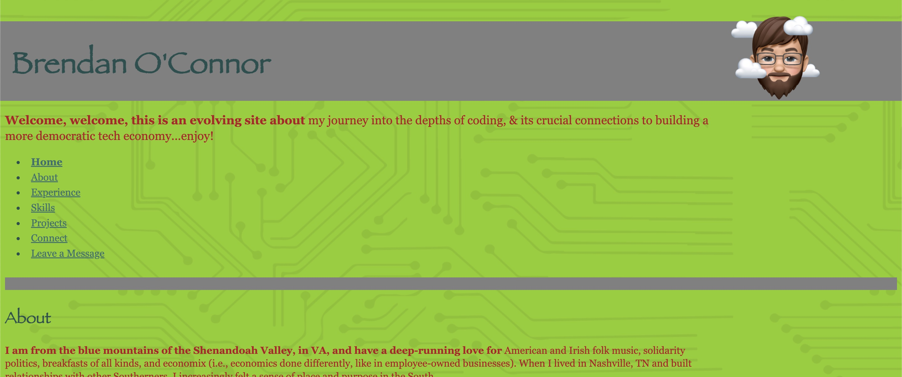

# Brendan O'Connor's Personal Portfolio

## Overview

This ten-week project with [Code the Dream](https://www.codethedream.org/) taught us how to build our own personal portfolio website step-by-step, using various skills, from JavaScript, CSS, and HTML to AJAX and fetch API.

## Site preview

See a basic preview of the site below:

## Viewing page

Go to [bhoconnor.github.io/personal-portfolio/](https://bhoconnor.github.io/personal-portfolio/) to view the deployed portfolio site.
